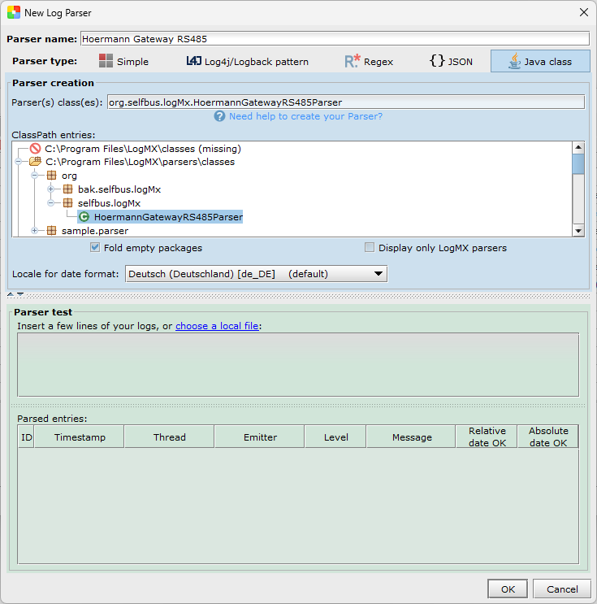

# LogMX Hoermann Parser

This is a simple Java LogMX parser for serial Hoermann debug logs.

## Build and install 
- Run to build and install the parser:
  - `.\gradlew.bat install -PlogmxDir="<Path to logMX directory>"` (Default `C:/Program Files/LogMX` on Windows)
  - `.\gradlew install -PlogmxDir="<Path to logMX directory>"` (Linux)

## Uninstall
- `.\gradlew.bat uninstall -PlogmxDir="<Path to logMX directory>"` (Default `C:/Program Files/LogMX` on Windows)
- `.\gradlew uninstall -PlogmxDir="<Path to logMX directory>"` (Linux)

## Add parser to LogMX
- Start LogMX and go to:
- File → Configure Parsers... → Add Parser... → Java class → ClassPath entries
- Search and select `org.selfbus.logMx.HoermannGatewayRS485Parser`  
  
- Press OK

## Usage
- Open a serial log file (e.g. [example.log](doc/example.log)) in LogMX
- LogMX should automatically detect the Hoermann parser and load the log entries.

## Requirements
- [LogMX](https://www.logmx.com/) >= 8.4.0
- [Gradle](https://gradle.org/) >= 9.2.1
- Java 8 or higher