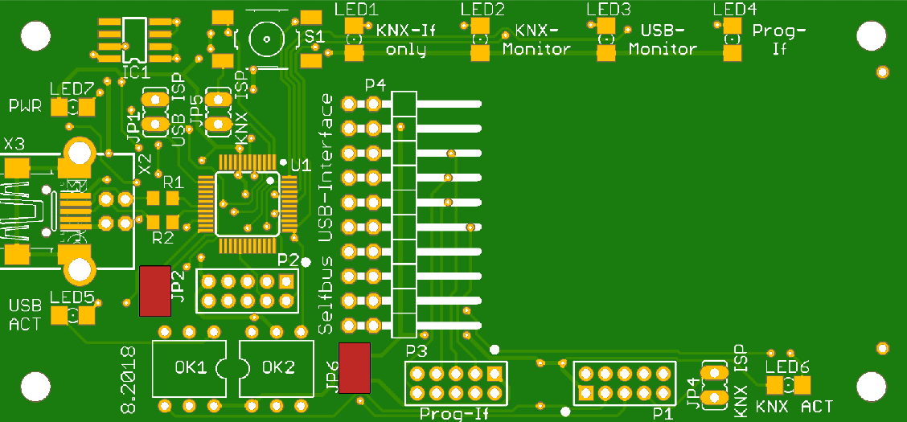
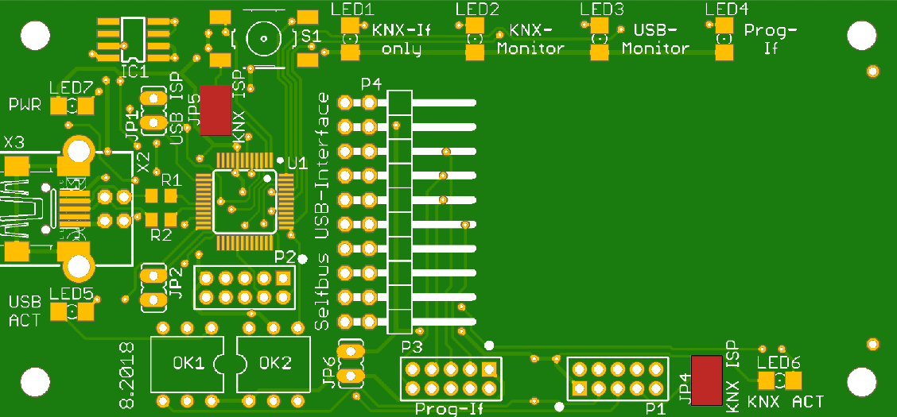
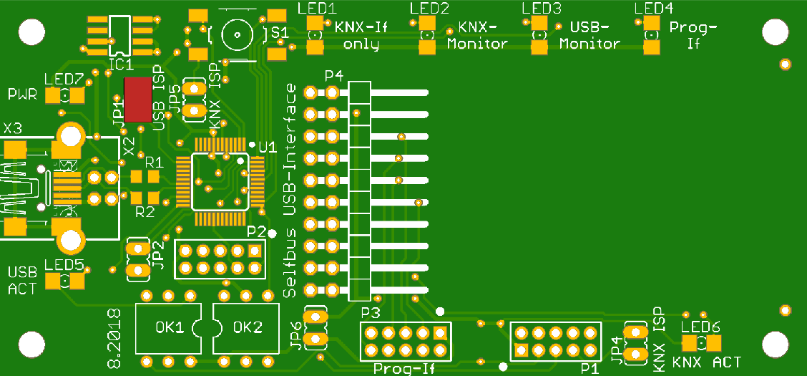
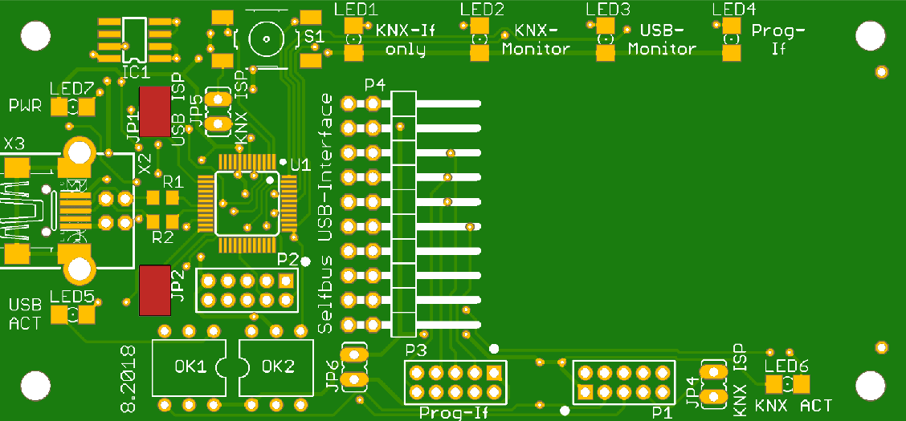
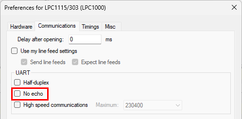
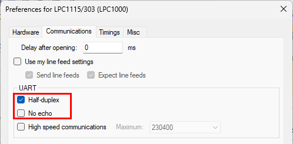

# KNX USB-Interface / Busmonitor / ISP Programmer

<!-- TOC -->
* [KNX USB-Interface / Busmonitor / ISP Programmer](#knx-usb-interface--busmonitor--isp-programmer)
    * [Normal operation](#normal-operation)
    * [Switch](#switch)
    * [Jumper](#jumper)
    * [Connectors](#connectors)
    * [ISP programming / flashing / updates](#isp-programming--flashing--updates)
      * [Selfbus ARM device/controller](#selfbus-arm-devicecontroller)
      * [KNX bus access controller (TS_ARM) firmware](#knx-bus-access-controller-ts_arm-firmware)
      * [USB mcu/controller U1 (LPC11U24/401)](#usb-mcucontroller-u1-lpc11u24401)
    * [Firmware](#firmware)
    * [Hardware / PCB](#hardware--pcb)
  * [Usage with knxd](#usage-with-knxd)
    * [Example `knxd.ini`](#example-knxdini)
    * [Start in terminal](#start-in-terminal)
    * [Create simple knxd.ini for USB-Interface](#create-simple-knxdini-for-usb-interface)
    * [udev rule](#udev-rule)
  * [Known Issues](#known-issues)
    * [ISP programming issues](#isp-programming-issues)
  * [Forum](#forum)
<!-- TOC -->

### Normal operation
- Remove all jumpers
- Plug TS_ARM into connector P4
- Connect P1 with a 10pole cable to the ISP connector of the TS_ARM (JP7 ISP)
- Connect USB and KNX-supply
- Select Operation mode with switch S1

### Switch
S1: Change operation modes

| Mode           | Color (#Led) | Description                                                                                                                                       |
|----------------|--------------|---------------------------------------------------------------------------------------------------------------------------------------------------|
| KNX-Interface  | yellow (1)   | USB-HID device which can be used in ETS, knxd, Selfbus Updater. May require [Zadig USB drivers](https://zadig.akeo.ie/) (winUSB) under Windows |
| KNX-Busmonitor | red (2)      | KNX traffic/telegrams are send in readable form to the virtual serial port                                                                        |
| USB-Monitor    | green (3)    | EMI 1 packets between USB host (ETS) and KNX bus access controller (TS_ARM) are send to the virtual serial port                                   |
| ISP-Programmer | blue (4)     | Serial port for programming a Selfbus ARM device connected to P3 (Prog-If) with e.g. [Flashmagic](https://www.flashmagictool.com/).               |

Virtual serial port settings: 115200 baud, 8 data bits, no parity, 1 stop bit

### Jumper

| Jumper | Function           | Description                                                                                               |
|:------:|--------------------|-----------------------------------------------------------------------------------------------------------|
|  JP1   | ISP enable USB-mcu | Enable ISP for USB-mcu U1 (11U24/401)                                                                     |
|  JP2   | ISP select USB-mcu | Select ISP mode for USB-mcu U1, off=ISP over USB (X3), on=ISP over UART (P2)                              |
|        |                    |                                                                                                           |
|  JP4   | ISP enable KNX-mcu | Enable ISP for KNX-mcu P4 (TS_ARM)                                                                        |
|  JP5   | ISP enable KNX-mcu | Enable ISP mode for KNX-mcu P4 (TS_ARM)                                                                   |
|  JP6   | VCC USER-mcu       | VCC +3.3V for Prog-If (P3) ISP connector generated by TS_ARM from the KNX bus which must be powered on |

### Connectors

| Conn. | Function      | Description                                              |
|-------|---------------|----------------------------------------------------------|
| P1    | ISP / KNX-mcu | normal operation and ISP programming of KNX-mcu (TS_ARM) |
| P2    | ISP USB-mcu   | ISP over UART for USB-mcu U1 (11U24/401)                 |
| P3    | Prog-If       | ISP User-mcu                                             |
| P4    | KNX-mcu       | KNX Bus access controller (TS_ARM)                       |

### ISP programming / flashing / updates

#### Selfbus ARM device/controller
- Disconnect USB and KNX-supply
- Close jumper JP2 and JP6 (+3.3V)  
  
- Connect the ARM controller´s ISP connector with a 10pole cable to the Prog-If connector (P3)  
- Connect USB and KNX-supply
- Select mode Prog-If (LED4 on) with switch S1
- Flash ARM controller with e.g. [Flashmagic](https://www.flashmagictool.com)
- Virtual serial port settings: 115200 baud, 8 data bits, no parity, 1 stop bit

#### KNX bus access controller (TS_ARM) firmware
- Disconnect USB and KNX-supply
- Close jumpers JP4 and JP5  
  
- Connect USB and KNX-supply
- All mode LEDs (LED1-4) should be on, indicating the ISP firmware update mode
- Flash the TS_ARM with e.g. [Flashmagic](https://www.flashmagictool.com)
- Virtual serial port settings: 9600 baud, 8 data bits, no parity, 1 stop bit

#### USB mcu/controller U1 (LPC11U24/401)
- ISP programming over USB (X1)
  * Disconnect USB and KNX-supply
  * Close jumper JP1  
    
  * Connect USB
  * Copy binary `*.bin` [usb-if_usb_release_vx.xx_libvx.xx.bin](https://github.com/selfbus/software-releases/tree/main/misc/USB-Interface-bcu1) to removable drive **LPC1XXX IFLASH**
- ISP programming over UART (P2)
  * Disconnect USB and KNX-supply
  * Close jumpers JP1 and JP2  
    
  * Connect ISP-Programmer to P2
  * Flash `*.hex` [usb-if_usb_release_vx.xx_libvx.xx.hex](https://github.com/selfbus/software-releases/tree/main/misc/USB-Interface-bcu1) with e.g. [Flashmagic](https://www.flashmagictool.com)

### Firmware

| MCU         | Github                                                                                                        |
|-------------|---------------------------------------------------------------------------------------------------------------|
| P4 (TS_ARM) | [USB-IF_Knx](https://github.com/selfbus/software-arm-incubation/tree/main/misc/USB-Interface-bcu1/USB-IF_Knx) |
| U1 (11uxx)  | [USB-IF_Usb](https://github.com/selfbus/software-arm-incubation/tree/main/misc/USB-Interface-bcu1/USB-IF_Usb) |

### Hardware / PCB
[USB-Interface ARM](https://github.com/selfbus/hardware-merged/tree/main/misc/usb_knx_interface_lpc1115)

## Usage with knxd

### Example `knxd.ini`

An example `knxd.ini` can be found [here](doc/knxd.ini).

### Start in terminal

`sudo knxd -e 0.0.1 -E 0.0.2:8 -D -T -R -S -f9 -B log -t 1023 -b usb:`

### Create simple knxd.ini for USB-Interface
`/usr/lib/knxd_args -e 0.0.1 -E 0.0.2:8 -D -T -R -S -f9 -B log -t 1023 -b usb: >> knxd.ini`

### udev rule

In case the USB-Interface is not listed in udev rules installed by knxd `/usr/lib/udev/rules.d/60-knxd.rules` 
create file `/etc/udev/rules.d/70-knxd.rules` and add following line 
`ACTION=="add", SUBSYSTEM=="usb", ATTR{idVendor}=="147b", ATTR{idProduct}=="5120", OWNER="knxd", MODE="0600"` to it, 
or run in a terminal 
`echo 'ACTION=="add", SUBSYSTEM=="usb", ATTR{idVendor}=="147b", ATTR{idProduct}=="5120", OWNER="knxd", MODE="0600"' | sudo tee --append /etc/udev/rules.d/70-knxd.rules`

## Known Issues

### ISP programming issues
- Since Flashmagic version 12.85 the checkbox *No echo* (menu *View->Preferences->Communications*) must be **unchecked**.  
  
- Very slow ISP programming (Prog-If mode) of an User-mcu connected to P3 (9600 baud, half-duplex).  
  The checkbox *Half-duplex* (menu *View->Preferences->Communications*) must be **checked**.  
  

## Forum

[Thread in Selfbus forum](https://selfbus.org/forum/viewtopic.php?f=6&t=487)

